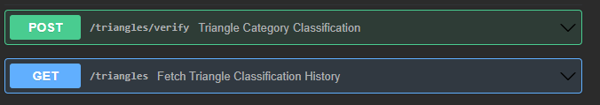
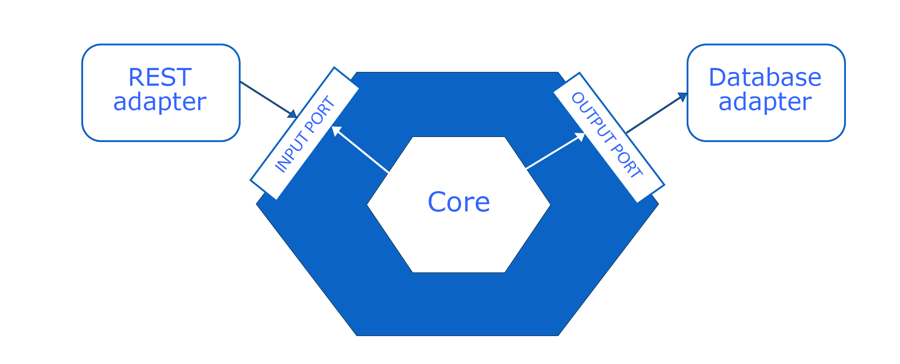

# 1nce Cloud Developer Challenge

## Triangle Classification API
The Triangle Classification API was written in JAVA using Spring Boot.

A REST API was created with the two requested endpoints:

  

The endpoint description can be consulted in the [Swagger](src/main/resources/swagger.yml). Both endpoints use JSON as requested.

This project was implemented using the Hexagonal Architecture. The hexagonal architecture, also known as the ports and adapters pattern, is a software design pattern that separates the internal logic of a system from its external interfaces, allowing for easy testing and maintenance by using 'ports' for external interactions and 'adapters' to connect to specific implementations.

  

## Table of contents

- [Code Structure](documentation/code-structure/README.md)
  - [Code](documentation/code-structure/README.md#code)
      - [Validation](documentation/code-structure/README.md#validation)
        - [Java Bean Validation Annotations](documentation/code-structure/README.md#java-bean-validation-annotations)
        - [Custom validation](documentation/code-structure/README.md#custom-validation)
      - [Controller Advice - Error Handling](documentation/code-structure/README.md#controller-advice---error-handling)
  - [Logging](documentation/code-structure/README.md#logging)
      - [Configuration](documentation/code-structure/README.md#configuration)
      - [Log levels](documentation/code-structure/README.md#log-levels)
- [Application deployment](documentation/deployment/README.md)
    - [EC2 deployment](documentation/deployment/README.md#EC2-deployment)
        - [Resources](documentation/deployment/README.md#Resources)
        - [Logging](documentation/deployment/README.md#Logging)
    - [Containerized deployment with Kubernetes](documentation/deployment/README.md#Containerized-deployment-with-Kubernetes)
      - [Chart](documentation/deployment/README.md#Maintainers)
- [Running instructions](documentation/run/README.md)
    - [Creating the docker image](documentation/run/README.md#creating-the-docker-image)
    - [Running the application](documentation/run/README.md#running-the-application)
      - [Local run](documentation/run/README.md#local-run)
      - [Docker compose](documentation/run/README.md#docker-compose)
    - [Running the tests](documentation/run/README.md#running-the-tests)
        - [Unit tests](documentation/run/README.md#unit-tests)
        - [Functional tests](documentation/run/README.md#functional-tests)
- [Tests](documentation/tests/README.md)
    - [Unit Testing](documentation/tests/README.md#unit-testing)
    - [Functional Testing with Postman & Newman](documentation/tests/README.md#functional-testing-with-postman--newman)
      - [Repository folder structure](documentation/tests/README.md#repository-folder-structure)
      - [Tests](documentation/tests/README.md#tests)
        - [POST /verify endpoint](documentation/tests/README.md#post-verify-endpoint)
        - [GET /triangles endpoint](documentation/tests/README.md#get-triangles-endpoint)
      - [Importing the files](documentation/tests/README.md#importing-the-files)
    - [Using newman](documentation/tests/README.md#using-newman)
      - [Install newman](documentation/tests/README.md#install-newman)
      - [Running the tests](documentation/tests/README.md#running-the-tests)

 
