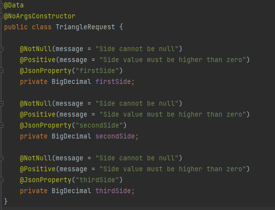
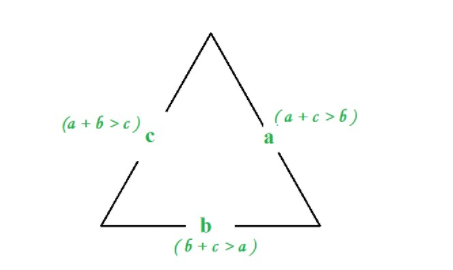

# Code Structure

## Code

### Validation

Input values are being validated using bean validation using
the [JSR 380 specification](https://www.baeldung.com/javax-validation)
annotations and custom logic.

#### Java Bean Validation Annotations

Several annotations were added to the different request DTOs that represent different validations.
<p align="center">
  
</p>

The annotations are self-explanatory and message is being used if the constraint validation fails.

#### Custom validation

Custom validation was created to validate if the values provided in the _/verify_ endpoint form a valid triangle. A
triangle is valid if the sum of its two sides is greater than the third side.
<p align="center">
  
</p>

The validation implementation can be found in
the [TriangleValidator](../../src/main/java/com/once/demoproject/validator/TriangleValidator.java) class.

### Controller Advice - Error Handling

The _ControllerAdvice_ annotation allows the consolidation of multiple exception handler methods into a single, global
error handling component. It gives full control over the body of the response as well as the status code, and provides
mapping of several exceptions to the same method, to be handled together. This allows to remove error handling from the
Controller classes.  For this application multiple controller advices were created for the following exceptions: `MethodArgumentNotValidException`, `ConnectException`
and `InvalidTriangleException`. All the other exceptions are handled by Spring's own ControllerAdvice classes. The
structure is:

```java
@ExceptionHandler(ConnectException.class)
public ResponseEntity<Error> handleConnectException(ConnectException ex){
        log.error(
        "Executed handleConnectException. Connection to the database failed. Further information: {} | Caused by: {} | Stack Trace: {}",
        ex.getLocalizedMessage(),ex.getCause(),ex.getStackTrace());
        return errorResponseFactory.create(HttpStatus.INTERNAL_SERVER_ERROR,create("Connection to the database failed"));
        }
```

A `errorResponseFactory` Factory was created to build the object that is returned to the user in case of error.

```java

@Component
public class ErrorResponseFactoryImpl implements ErrorResponseFactory {
    @Override
    public <T> ResponseEntity<T> create(HttpStatus status, T body) {
        return ResponseEntity.status(status).body(body);
    }
}
```

The object returned to the user in case of error is:

```java

@Data
@Builder
public class Error implements Serializable {

    private LocalDateTime timestamp;
    private String message;
}
```

## Logging

As required the application has logs. The framework used is log4j2.

### Configuration

The configuration is described in the [log4j2-spring.xml](../../src/main/resources/log4j2-spring.xml). In other projects
it is standard that the logs are in the JSON format to facilitate search and reading in applications like Kibana, CloudWatch or
Graphana, but it was decided that the format would be the default one.

### Log levels
Throughout the application logs can be found. There are debug level logs in the service class to log important information
and error level logs to log errors in case an exception occurs.