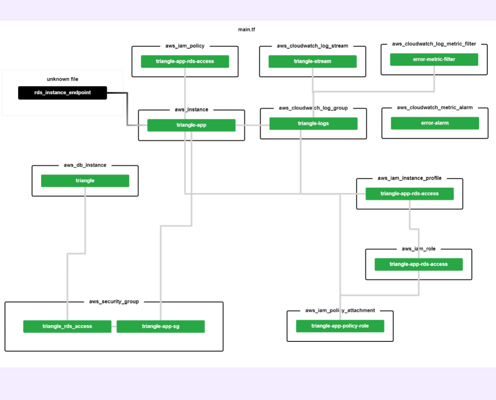
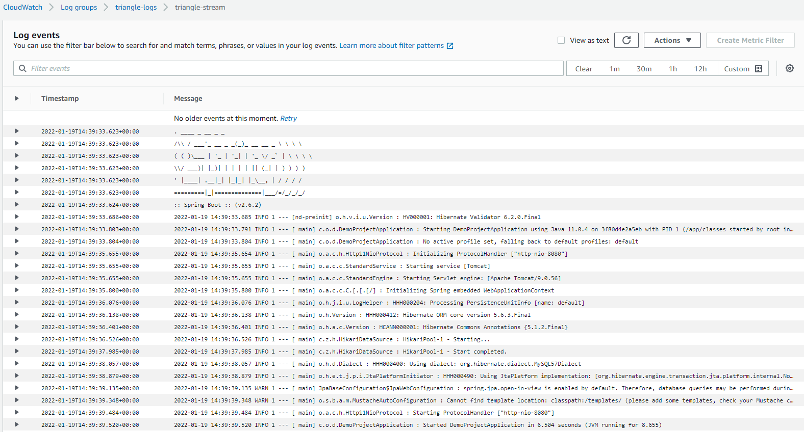

# Application deployment

For this project Docker was used to build a container image. As of today, a containerized deployment was not created
but it is planned for the future.

## EC2 deployment
For this type of deployment, and as an experiment, Terraform was used to create and deploy the application. Terraform related
files are in the _terraform_ project folder. As it was not the purpose of this project, no security configurations were
created for the aws resources. The IAM user was created with _AdministratorAccess_ policy. The resources were deployed
using the classic `plan` and `apply` terraform commands.

----------------------------------------------
Autogenerated from terraform using [Rover](https://github.com/im2nguyen/rover)

### Providers

| Name | Version |
|------|---------|
|  [aws](#provider\_aws) | 3.72.0 |

### Resources

| Name | Type |
|------|------|
| [aws_cloudwatch_log_group.triangle-logs](https://registry.terraform.io/providers/hashicorp/aws/latest/docs/resources/cloudwatch_log_group) | resource |
| [aws_cloudwatch_log_metric_filter.error-metric-filter](https://registry.terraform.io/providers/hashicorp/aws/latest/docs/resources/cloudwatch_log_metric_filter) | resource |
| [aws_cloudwatch_log_stream.triangle-stream](https://registry.terraform.io/providers/hashicorp/aws/latest/docs/resources/cloudwatch_log_stream) | resource |
| [aws_cloudwatch_metric_alarm.error-alarm](https://registry.terraform.io/providers/hashicorp/aws/latest/docs/resources/cloudwatch_metric_alarm) | resource |
| [aws_db_instance.triangle](https://registry.terraform.io/providers/hashicorp/aws/latest/docs/resources/db_instance) | resource |
| [aws_iam_instance_profile.triangle-app-rds-access](https://registry.terraform.io/providers/hashicorp/aws/latest/docs/resources/iam_instance_profile) | resource |
| [aws_iam_policy.triangle-app-rds-access](https://registry.terraform.io/providers/hashicorp/aws/latest/docs/resources/iam_policy) | resource |
| [aws_iam_policy_attachment.triangle-app-policy-role](https://registry.terraform.io/providers/hashicorp/aws/latest/docs/resources/iam_policy_attachment) | resource |
| [aws_iam_role.triangle-app-rds-access](https://registry.terraform.io/providers/hashicorp/aws/latest/docs/resources/iam_role) | resource |
| [aws_instance.triangle-app](https://registry.terraform.io/providers/hashicorp/aws/latest/docs/resources/instance) | resource |
| [aws_security_group.triangle-app-sg](https://registry.terraform.io/providers/hashicorp/aws/latest/docs/resources/security_group) | resource |
| [aws_security_group.triangle_rds_access](https://registry.terraform.io/providers/hashicorp/aws/latest/docs/resources/security_group) | resource |

As the database endpoint is not known until creation time the value is injected using Terraform variables and replaced in the [backend.sh](../../terraform/scripts/backend.sh) script
using the _sed_ command.
### Logging
The application logs are automatically sent to Amazon CloudWatch through the CloudWatch agent. Using a log4j2 configuration file the
logs are being sent to a file that is also read by the agent that in turn sends the logs to CloudWatch. Please refer to the [backend.sh](../../terraform/scripts/backend.sh) script for 
details on how the agent was installed and configured

## Containerized deployment with Kubernetes
Also for consolidation of knowledge a Helm chart was created and if necessary can be deployed in a kubernetes cluster. As a database
is necessary the _triangle-app_ chart makes use of a [mysql sub-chart](https://artifacthub.io/packages/helm/bitnami/mysql) provided by Bitnami.
Only the username and password configuration is overridden.

  

A Helm chart for the Triangle Application

### Maintainers

| Name | Email | Url |
| ---- | ------ | --- |
| Nuno Ferreira | <nunocardia21@gmail.com> | <https://github.com/NunoCardia> |

### Requirements

| Repository | Name | Version |
|------------|------|---------|
| https://charts.bitnami.com/bitnami | mysql | 9.4.8 |

### Values

| Key | Type | Default | Description |
|-----|------|---------|-------------|
| kubernetes.namespace | string | `"dev"` |  |
| kubernetes.resources.limits.cpu | string | `"1000m"` |  |
| kubernetes.resources.limits.memory | string | `"1500Mi"` |  |
| kubernetes.resources.requests.cpu | string | `"100m"` |  |
| kubernetes.resources.requests.memory | string | `"128Mi"` |  |
| kubernetes.service.port | int | `8080` |  |
| kubernetes.service.type | string | `"LoadBalancer"` |  |
| mysql.auth.database | string | `"triangle"` |  |
| mysql.auth.password | string | `"testpassword"` |  |
| mysql.auth.username | string | `"once"` |  |
| mysql.fullnameOverride | string | `"triangle-mysql"` |  |
| mysql.namespaceOverride | string | `"dev"` |  |
| triangle_app.datasource.database | string | `"triangle"` |  |
| triangle_app.datasource.host | string | `"triangle-app"` |  |
| triangle_app.datasource.jdbc | string | `"jdbc:mysql"` |  |
| triangle_app.datasource.params | string | `"createDatabaseIfNotExist=true"` |  |
| triangle_app.datasource.port | int | `3306` |  |
| triangle_app.docker.pullPolicy | string | `"IfNotPresent"` |  |
| triangle_app.docker.repository | string | `"triangle-app"` |  |
| triangle_app.docker.tag | string | `"0.1.0"` |  |
| triangle_app.probes.liveness | string | `"/actuator/health/liveness"` |  |
| triangle_app.probes.readiness | string | `"/actuator/health/readiness"` |  |

----------------------------------------------
Autogenerated from chart metadata using [helm-docs v1.11.0](https://github.com/norwoodj/helm-docs/releases/v1.11.0)
