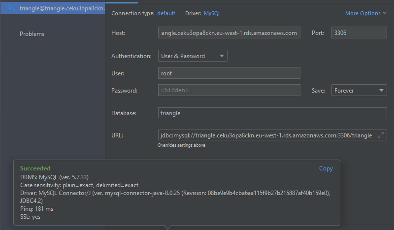
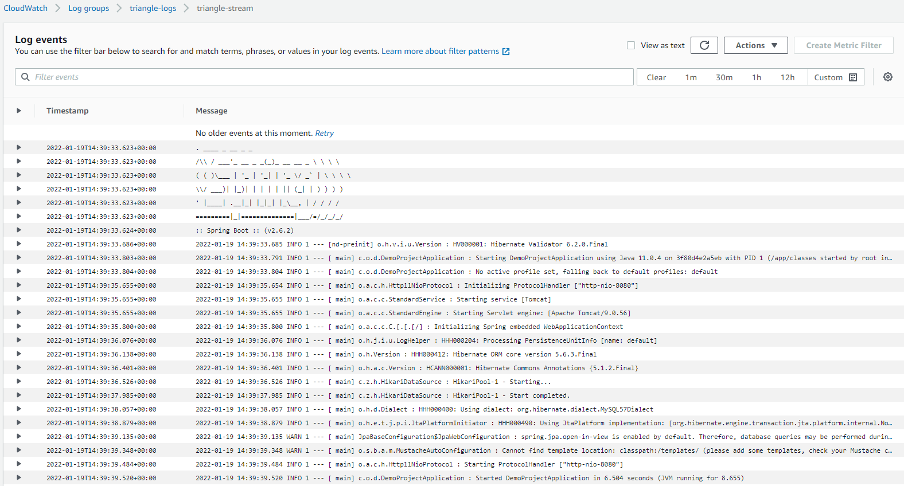

# Infrastructure

As indicated the infrastructure for this project is represented by code using Terraform. Terraform related
files are in the _terraform_ project folder. As it was not the purpose of this project, no security configurations were
created for the aws resources. The IAM user was created with _AdministratorAccess_ policy. The resources were deployed 
using the classic `plan` and `apply` terraform commands.

## Providers
Terraform file documentation was generated using [terraform-docs](https://github.com/terraform-docs/terraform-docs).

| Name                                              | Version |
|---------------------------------------------------|---------|
| <a name="provider_aws"></a> [aws](#provider\_aws) | 3.72.0  |

## Resources

| Name                                                                                                                                                             | Type     |
|------------------------------------------------------------------------------------------------------------------------------------------------------------------|----------|
| [aws_cloudwatch_log_group.triangle-logs](https://registry.terraform.io/providers/hashicorp/aws/latest/docs/resources/cloudwatch_log_group)                       | resource |
| [aws_cloudwatch_log_metric_filter.error-metric-filter](https://registry.terraform.io/providers/hashicorp/aws/latest/docs/resources/cloudwatch_log_metric_filter) | resource |
| [aws_cloudwatch_log_stream.triangle-stream](https://registry.terraform.io/providers/hashicorp/aws/latest/docs/resources/cloudwatch_log_stream)                   | resource |
| [aws_cloudwatch_metric_alarm.error-alarm](https://registry.terraform.io/providers/hashicorp/aws/latest/docs/resources/cloudwatch_metric_alarm)                   | resource |
| [aws_db_instance.triangle](https://registry.terraform.io/providers/hashicorp/aws/latest/docs/resources/db_instance)                                              | resource |

## Database

AN RDS database was created using the following code:

```terraform
resource "aws_db_instance" "triangle" {
  identifier             = "triangle"
  instance_class         = "db.t2.micro"
  allocated_storage      = 5
  engine                 = "mysql"
  engine_version         = "5.7"
  username               = "root"
  password               = "thepassword"
  parameter_group_name = "default.mysql5.7"
  publicly_accessible    = true
  skip_final_snapshot    = true
  vpc_security_group_ids = []
}
```

A successful connection was made using IntelliJ:



The _triangle_info_ table is created automatically by Hibernate using the `spring.jpa.hibernate.ddl-auto` property in the
project [application.properties](../../src/main/resources/application.properties) file.

## CloudWatch

For the cloudWatch service, the log resources were created:

```terraform
resource "aws_cloudwatch_log_group" "triangle-logs" {
  name = "triangle-logs"
  retention_in_days = 30
}

resource "aws_cloudwatch_log_stream" "triangle-stream" {
  name           = "triangle-stream"
  log_group_name = aws_cloudwatch_log_group.triangle-logs.name
}

resource "aws_cloudwatch_log_metric_filter" "error-metric-filter" {
  name           = "error-metric-filter"
  log_group_name = aws_cloudwatch_log_group.triangle-logs.name
  pattern        = "ERROR"
  metric_transformation {
    name      = "ErrorLogMetric"
    namespace = "TriangleMetrics"
    value     = "1"
  }
}

resource "aws_cloudwatch_metric_alarm" "error-alarm" {
  alarm_name = "error-log-alarm"
  metric_name         = aws_cloudwatch_log_metric_filter.error-metric-filter.name
  threshold           = "0"
  statistic           = "Sum"
  comparison_operator = "GreaterThanThreshold"
  datapoints_to_alarm = "1"
  evaluation_periods  = "1"
  period              = "30"
  namespace           = "TriangleMetrics"
}
```
As requested the log retention period is set and one alarm was created for when the application logs an error.
After running the [docker-compose command](../run/README.md#distributed-setup) the logs were outputted to CloudWatch:



## API Gateway

Due to time constraints the API Gateway related tasks were not completed in time.