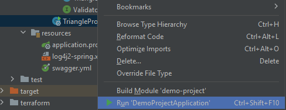
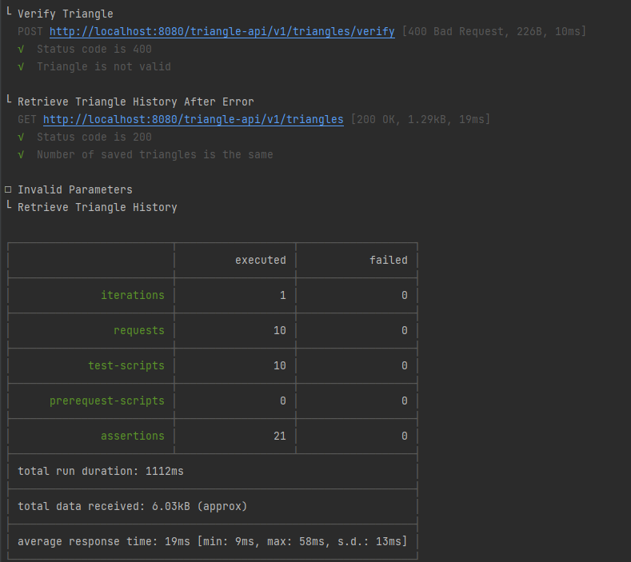
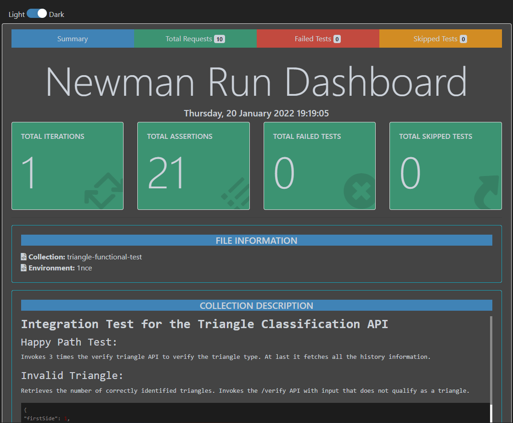

# Running instructions

## Creating the docker image
To create the docker image just run:
> mvn clean install

and if you check your local images the `triangle-backend` image should be there. Keep in mind that Jib executes during the maven `compile` lifecycle so if you run this command **it will also
create the docker image**. To skip the docker image creation just add the following flag to all maven related commands:
`-Djib.skip`.

## Running the application

The application can be run in multiple ways:

### Local run
Import the project to Intellij, right-click the main class and press run option.

Note: by default the application expects a MySQL database running in your computer. If you have a different database
change the property values in the [application.properties](../../src/main/resources/application.properties) file.
If you want to use a local instance of a MySQL database using docker please refer to the official [Dockerhub
documentation](https://hub.docker.com/_/mysql) on how to start a MySQL instance.

### Docker compose

#### Local setup
To run a local instance version of this project execute the command:
>docker compose -f docker-compose-local.yml up -d

The file includes a mysql service based on the official MySQL image.

#### Distributed setup

The [docker compose](../../docker-compose.yml) file is prepared to send the logs to CloudWatch. If you choose
this option please make sure that the resources declared in the _terraform_ folder are created before executing
the application by going to the _terraform_ folder and execute:
> terraform init
> 
> terraform plan
> 
> terraform apply

If you choose to use your own CloudWatch resources please change the logging option values before executing the application
in the [docker compose](../../docker-compose.yml).

If you already have a MySQL instance created in Docker or RDS change the environment variable values in 
the [docker compose](../../docker-compose.yml) file and execute the following command:

>docker compose -f docker-compose.yml up -d

## Running the tests

### Unit tests
To run the unit tests go to the project root and execute:
> mvn clean test

This will also create the project docker image. Please refer to the [docker image section](README.md#creating-the-docker-image) to change this.

### Functional tests
**Important:** Both the backend service and the database must be running before the test execution. Please refer to the
[running instructions' section](README.md#running-the-application) for more information on how to run the services.

In _functional-test_ folder run:

* output on command line
> newman run 1nce.postman_environment.json -e triangle-functional-test.postman_collection.json

* output in a report
> newman run 1nce.postman_environment.json -e triangle-functional-test.postman_collection.json -r htmlextra

The HTML report is also included in the _functional-tests/newman_ folder.