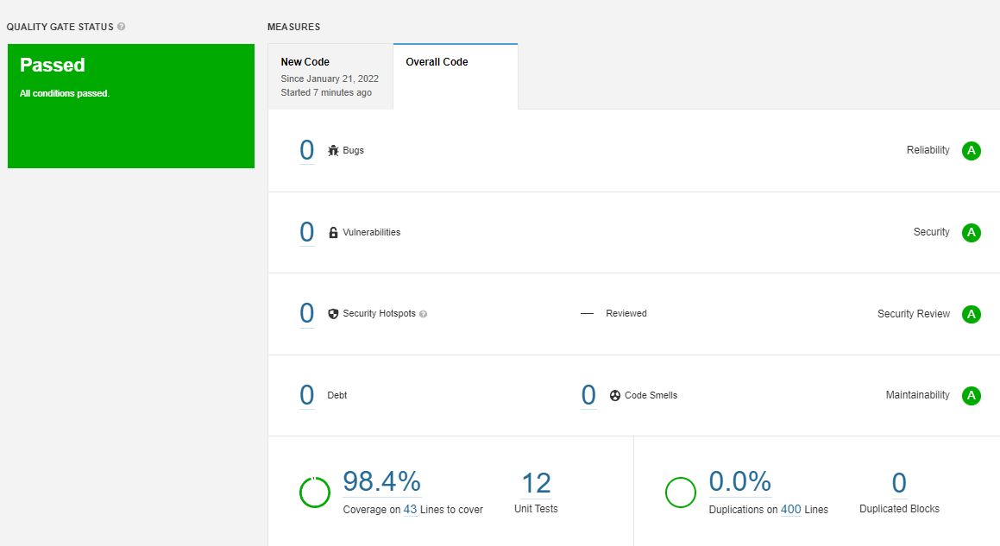
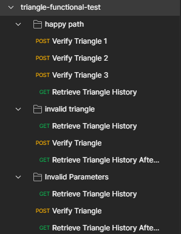
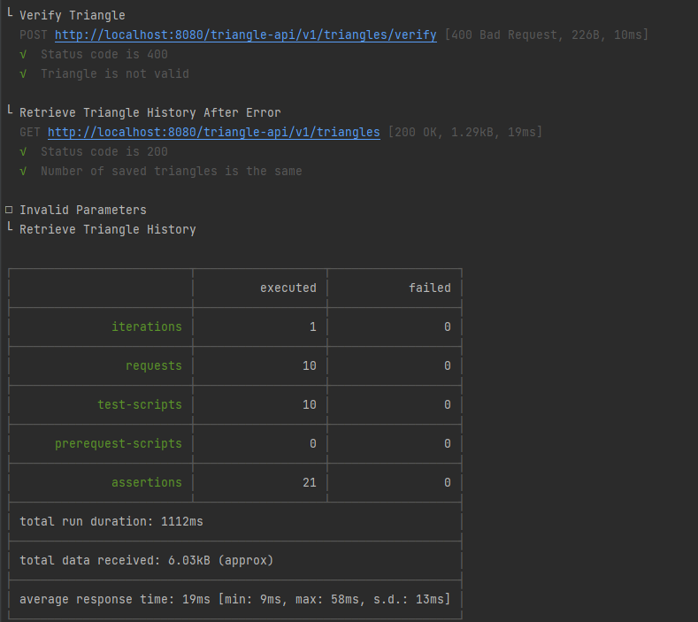
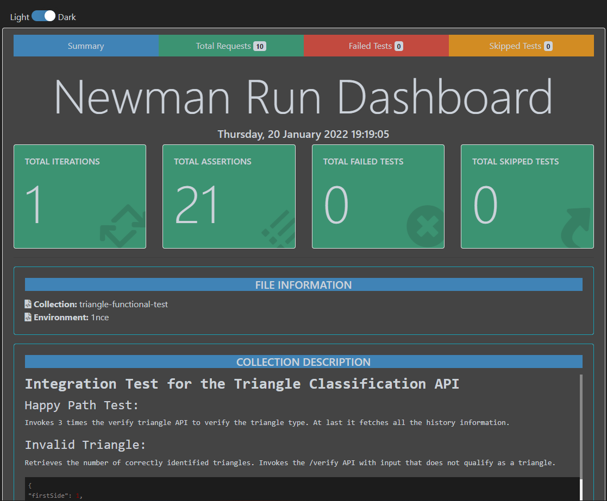

# Tests

## Unit Testing
Unit tests were performed on all necessary classes using Junit5 and Mockito. Some exclusions
were added to exclude classes from Sonarqube test coverage analysis as it does not make
sense to test them (e.g. configuration and model classes). Please refer to the _<sonar.exclusions>_ property in the [pom.xml](../../pom.xml) file for the complete list of
excluded classes. Sonar outputted:



To run the unit tests go to the project root and execute:
> mvn test

## Integration Testing
To test the entire application without mocking or complicated environment configurations integration tests were created.
The tool that was used is [TestContainers](https://testcontainers.com/).

Testcontainers is an open source framework for providing throwaway, lightweight instances of databases, message brokers, web browsers, or just about anything that can run in a Docker container.
In the context of this project it was used to create a generic MySQL container with some sample data already placed in at initialization time.

The tests are available in the _triangle-application_ module.

### Running the tests

To run the unit tests go to the project root and execute:
> mvn verify -Pit -Djib.skip

As integration tests are often ran in a separate stage of the pipeline a maven profile was created so that they can be specifically
called for in a pipeline context. Without the profile id the integration tests are not executed. 

As TestContainers is a container based product Docker is required so that Testcontainers can work.

## Functional Testing with Postman & Newman


### Repository folder structure
To test the API use cases multiple requests were created, each one with testing associated with them. The tests were divided by use case. 



* **Happy path use case** - no exceptions are expected and every triangle that is verified is valid. The _POST_
requests send a valid triangle for classification and the result is stored in the database. The last _GET_ request
invokes the endpoint responsible to retrieve the history from the database.
* **Invalid triangle use case** - in this use case first we check the number of correctly identified triangles,
then we invoke the verification endpoint with an invalid triangle and at the end we verify if the number of
correctly identified triangles stayed the same.
* **Invalid parameters use case** - similar use case to the previous one but the difference here is that
one field is an invalid parameter. The goal of the test is the same as the previous use case.

### Tests

Tests were created by creating a collection of requests in postman, in this case, the _triangle-functional-test_ collection
contains the previously mentioned use cases for testing.

#### POST /verify endpoint
The tests bellow verify if the request was successful and the response has the expected structure.

```javascript
var expectedHttpStatus = 200;
var expectedClassification = "equilateral"

pm.test("Status code is " + expectedHttpStatus, function () {
 pm.response.to.have.status(expectedHttpStatus);
});

var response = pm.response.json();

pm.test("Triangle has the correct classification", function () {
 pm.expect(response).to.have.property("category").to.eq(expectedClassification);
});
```
For use cases where errors are expected the assertions are the following:

```javascript
var expectedHttpStatus = 400;
var expectedMessage = "Input given is not a valid triangle";


pm.test("Status code is " + expectedHttpStatus, function () {
 pm.response.to.have.status(expectedHttpStatus);
});

var response = pm.response.json();

pm.test("Triangle is not valid", function () {
 pm.expect(response).to.have.property("message").to.eq(expectedMessage);
});
```
The `expectedHttpStatus` and `expectedMessage` variables change if the error is related to field validation

#### GET /triangles endpoint
The logic here is the same as in the previous section:
```javascript

var expectedHttpStatus = 200;

pm.test("Status code is " + expectedHttpStatus, function () {
        pm.response.to.have.status(expectedHttpStatus);
});

var response = pm.response.json();
var firstTriangle = response[0];
var secondTriangle = response[1];
var thirdTriangle = response[2];
var firstTriangleClassification = "scalene";
var secondTriangleClassification = "equilateral";
var thirdTriangleClassification = "isosceles";

pm.test("List has three or more elements", function () {
    pm.expect(response.length).to.be.above(2);
});

pm.test("First Triangle has the correct classification", function () {
    pm.expect(firstTriangle).to.have.property("category").to.eq(firstTriangleClassification);
});

pm.test("Second Triangle has the correct classification", function () {
    pm.expect(secondTriangle).to.have.property("category").to.eq(secondTriangleClassification);
});

pm.test("Third Triangle has the correct classification", function () {
    pm.expect(thirdTriangle).to.have.property("category").to.eq(thirdTriangleClassification);
});
```
The assertions to verify the number of correctly identified triangles are the following:
```javascript
var expectedHttpStatus = 200;

pm.test("Status code is " + expectedHttpStatus, function () {
        pm.response.to.have.status(expectedHttpStatus);
});

var response = pm.response.json();

 pm.environment.set("triangles", response.length);
```

Here we are using Postman environment variables to pass values from one request to the other. And to check 
if the number of correctly identified triangles is the same the code is:
```javascript

var expectedHttpStatus = 200;
var triangles = pm.environment.get("triangles");

pm.test("Status code is " + expectedHttpStatus, function () {
        pm.response.to.have.status(expectedHttpStatus);
});

var response = pm.response.json();

pm.test("Number of saved triangles is the same", function () {
        pm.expect(response.length).to.eq(triangles);
});
```

**Note:** Postman creates an environment variables structure to store variables associated with the collection
and that file will be needed to run tests using Newman.

### Importing the files
The test collection and environment variables files are located in the _functional-tests_ folder. To import them
into postman just press Ctrl/Cmd+O or using the Import button in the top left corner.

### Using newman

Newman is a command line Collection Runner for Postman. It allows you to run and test a Postman Collection directly from the command line. It is built with extensibility in mind so that you can easily integrate it with your continuous integration servers and build systems.

Newman maintains feature parity with Postman and allows you to run collections the way they are executed inside the collection runner in the Postman app.

### Install newman

> npm install -g newman
> 
> npm install -g newman-reporter-htmlextra

### Running the tests
**Important:** Both the backend service and the database must be running before the test execution. Please refer to the
[running instructions' section](README.md#running-the-application) for more information on how to run the services.

In _functional-test_ folder run:

* output on command line
> newman run 1nce.postman_environment.json -e triangle-functional-test.postman_collection.json


* output in a report
> newman run 1nce.postman_environment.json -e triangle-functional-test.postman_collection.json -r htmlextra


The HTML report is also included in the _functional-tests/newman_ folder.